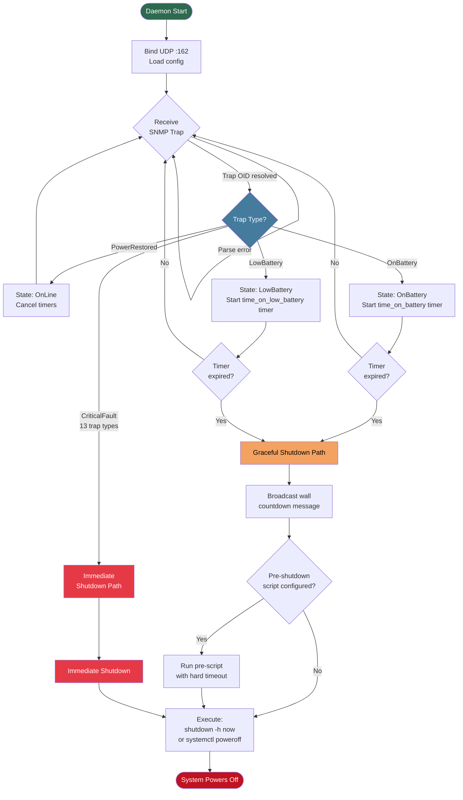

# UPS Shutdown Daemon

> **Production-ready Rust daemon for PPC / Upsmate enterprise UPS devices**  
> Listens for SNMP traps (OID `1.3.6.1.4.1.935`) and triggers clean, timer-based or immediate system shutdowns.

[](CHANGELOG.md)
[](LICENSE)
[](https://www.rust-lang.org/)
[](Cargo.toml)

---

## Table of Contents

- [Why This Daemon?](#why-this-daemon)
- [How It Works](#how-it-works)
- [Architecture Overview](#architecture-overview)
- [State Machine Flowchart](#state-machine-flowchart)
- [Features](#features)
- [Supported SNMP Traps](#supported-snmp-traps)
- [Installation](#installation)
- [Configuration](#configuration)
- [Running as a systemd Service](#running-as-a-systemd-service)
- [Log Management](#log-management)
- [Testing](#testing)
- [Pre-Shutdown Script](#pre-shutdown-script)
- [Signal Handling](#signal-handling)
- [Security & Capabilities](#security--capabilities)
- [Helper Utilities](#helper-utilities)
- [Project Structure](#project-structure)
- [Changelog](#changelog)

---

## Why This Daemon?

Most UPS software either:

- Requires a heavy Java GUI, or
- Only supports USB (via NUT), or
- Relies on fragile shell scripts prone to timer race conditions.

`ups-shutdown-daemon` is a **tiny**, **zero-dependency**, **bulletproof** replacement:

| Property | Detail |
|---|---|
| Language | 100% Rust |
| Binary Size | ~800 KB stripped |
| Dependencies | Zero external runtime deps |
| Architecture | Proper state machine (no races) |
| Shutdown Types | Timer-based + instant |
| Notifications | Graceful countdown via `wall` messages |
| Script Support | Pre-shutdown hook with hard timeout |
| Log Rotation | SIGHUP-safe, zero data loss |
| Test Coverage | Full state machine unit tests |

---

## How It Works

The daemon binds to UDP port 162 (standard SNMP trap receiver port) and parses incoming SNMPv1/v2c trap packets. It decodes the OID enterprise prefix `1.3.6.1.4.1.935`, extracts the specific trap type, and transitions through a state machine accordingly.

Two independent timers guard against data loss:

1. **`time_on_battery`** — starts counting when the UPS reports it has switched to battery power. If the host is still running on battery when this timer expires, shutdown is triggered.
2. **`time_on_low_battery`** — starts counting when the UPS reports low battery. This is typically a shorter, more urgent deadline.

Whichever timer fires first wins and initiates the shutdown sequence.

For 13 critical fault conditions (e.g. overload, UPS discharged, diagnostics failure), the daemon bypasses the timer entirely and shuts down **immediately**.

---

## Architecture Overview

```
UPS Device (PPC / Upsmate)
       │
       │  SNMP Trap (UDP/162)
       ▼
┌─────────────────────────┐
│   ups-shutdown-daemon   │
│                         │
│  ┌───────────────────┐  │
│  │  UDP Trap Listener│  │
│  │  (port 162)       │  │
│  └────────┬──────────┘  │
│           │              │
│  ┌────────▼──────────┐  │
│  │  SNMPv1/v2c Parser│  │
│  │  OID 1.3.6.1.4.1  │  │
│  │         .935      │  │
│  └────────┬──────────┘  │
│           │              │
│  ┌────────▼──────────┐  │
│  │   State Machine   │  │
│  │  (race-free)      │  │
│  └────────┬──────────┘  │
│           │              │
│  ┌────────▼──────────┐  │
│  │  Shutdown Engine  │  │
│  │  - wall messages  │  │
│  │  - pre-script     │  │
│  │  - systemctl/     │  │
│  │    shutdown -h    │  │
│  └───────────────────┘  │
└─────────────────────────┘
       │
       │  Writes logs + syslog
       ▼
  /var/log/ups-traps.log
```

---

## State Machine Flowchart



---

## Features

### SNMP Parsing
- SNMPv1 and SNMPv2c trap parsing with **no external SNMP library** — fully self-contained.
- Targets enterprise OID `1.3.6.1.4.1.935` (PPC / Upsmate vendor branch).

### Two-Stage Timer Logic
- **`time_on_battery`** (default: 600 s) — grace period after power loss before shutdown.
- **`time_on_low_battery`** (default: 120 s) — urgency timer triggered by low-battery trap.
- Both timers run concurrently; whichever fires first wins. Timers reset on power restore.

### Instant Shutdown Traps
13 trap types trigger immediate shutdown without waiting for timers:

- `DiagnosticsFailed`
- `UpsDischarged`
- `OverLoadShutdown`
- `TemperatureShutdown`
- `FanFailure`
- `OutputFailure`
- `BatteryFailure`
- `InverterFailure`
- `RectifierFailure`
- `BypassFailure`
- `CommunicationFailure`
- `EmergencyOff`
- `SiteWiringFault`

### User Experience & Safety
- Broadcasts graceful **countdown messages via `wall`** before shutdown.
- Configurable **pre-shutdown script** with a hard execution timeout to prevent hangs.
- **Test mode** (`--test-mode`) — simulates the full daemon lifecycle without actually shutting the system down. Safe for CI and staging.

### Observability
- Verbose structured logging to a **dedicated log file**.
- Simultaneous **syslog** output.
- **SIGHUP** triggers log file rotation with zero data loss.

### Deployment
- Ships with a ready-to-use **systemd unit file**.
- Ships with a **logrotate configuration**.
- Minimal Linux **capabilities** (`NET_BIND_SERVICE` + `SYS_BOOT`) — drops all others at startup.

---

## Supported SNMP Traps

| Trap Name | Behavior |
|---|---|
| `PowerRestored` | Cancel timers, return to normal state |
| `OnBattery` | Start `time_on_battery` countdown |
| `LowBattery` | Start `time_on_low_battery` countdown |
| `DiagnosticsFailed` | **Immediate shutdown** |
| `UpsDischarged` | **Immediate shutdown** |
| `OverLoadShutdown` | **Immediate shutdown** |
| `TemperatureShutdown` | **Immediate shutdown** |
| `FanFailure` | **Immediate shutdown** |
| `OutputFailure` | **Immediate shutdown** |
| `BatteryFailure` | **Immediate shutdown** |
| `InverterFailure` | **Immediate shutdown** |
| `RectifierFailure` | **Immediate shutdown** |
| `BypassFailure` | **Immediate shutdown** |
| `CommunicationFailure` | **Immediate shutdown** |
| `EmergencyOff` | **Immediate shutdown** |
| `SiteWiringFault` | **Immediate shutdown** |

---

## Installation

### Prerequisites

- Rust toolchain (`cargo`) — install via [rustup](https://rustup.rs/)
- Linux system with systemd
- Root or `sudo` access

### Build & Install

```bash
# Clone the repository
git clone https://github.com/dimon757/ups-shutdown-daemon.git
cd ups-shutdown-daemon

# Build release binary
cargo build --release

# Install binary
sudo cp target/release/ups-shutdown-daemon /usr/local/sbin/

# Create config directory
sudo mkdir -p /etc/ups-shutdown

# Copy default configuration
sudo cp config.toml /etc/ups-shutdown/config.toml

# Install systemd unit
sudo cp ups-shutdown-daemon.service /etc/systemd/system/

# Install logrotate config
sudo cp ups-traps.logrotate /etc/logrotate.d/ups-traps
```

---

## Configuration

Edit `/etc/ups-shutdown/config.toml`:

```toml
# UDP port to listen for SNMP traps (default: 162, requires NET_BIND_SERVICE)
listen_port = 162

# Time in seconds on battery before triggering shutdown
time_on_battery = 600

# Time in seconds after low-battery trap before triggering shutdown
time_on_low_battery = 120

# Path to the log file
log_file = "/var/log/ups-traps.log"

# Optional: path to a script to run before shutdown (leave empty to skip)
pre_shutdown_script = "/etc/ups-shutdown/pre-shutdown.sh"

# Hard timeout for pre-shutdown script execution (seconds)
pre_shutdown_timeout = 30

# Enable syslog output
syslog = true

# Enable verbose logging
verbose = false
```

---

## Running as a systemd Service

```bash
# Reload systemd and enable the service
sudo systemctl daemon-reload
sudo systemctl enable ups-shutdown-daemon
sudo systemctl start ups-shutdown-daemon

# Check status
sudo systemctl status ups-shutdown-daemon

# View live logs
sudo journalctl -u ups-shutdown-daemon -f
```

The service file drops all capabilities except `NET_BIND_SERVICE` (to bind port 162) and `SYS_BOOT` (to trigger shutdown).

---

## Log Management

Logs are written to `/var/log/ups-traps.log` (configurable).

### Manual log rotation via SIGHUP

```bash
sudo kill -HUP $(pidof ups-shutdown-daemon)
```

The daemon will close the current log file, rotate it, and open a new one — without losing any events.

### Automatic rotation via logrotate

The included `ups-traps.logrotate` configuration handles periodic rotation and sends SIGHUP automatically:

```
/var/log/ups-traps.log {
    daily
    rotate 14
    compress
    missingok
    notifempty
    postrotate
        kill -HUP $(pidof ups-shutdown-daemon) 2>/dev/null || true
    endscript
}
```

---

## Testing

### Test Mode

Run the daemon in test mode — it processes all traps and state transitions but does **not** call the actual shutdown command:

```bash
ups-shutdown-daemon --test-mode --config /etc/ups-shutdown/config.toml
```

### Sending Synthetic SNMP Traps

Use the included Python utility to fire test traps at the daemon:

```bash
# Install dependency
pip install pysnmp

# Send an OnBattery trap
python send-ups-traps.py --host 127.0.0.1 --trap OnBattery

# Send an immediate-shutdown trap
python send-ups-traps.py --host 127.0.0.1 --trap DiagnosticsFailed

# Send a PowerRestored trap (cancel timers)
python send-ups-traps.py --host 127.0.0.1 --trap PowerRestored
```

### Unit Tests

```bash
cargo test
```

All state machine transitions are covered by unit tests. No hardware required.

---

## Pre-Shutdown Script

You can configure an optional script that runs before the system shuts down. This is useful for:

- Gracefully stopping databases or application services.
- Unmounting network filesystems.
- Sending alerts (email, Slack, PagerDuty, etc.).
- Syncing data to remote storage.

Example `/etc/ups-shutdown/pre-shutdown.sh`:

```bash
#!/bin/bash
set -euo pipefail

logger "UPS pre-shutdown script starting"

# Stop critical services
systemctl stop postgresql || true
systemctl stop nginx || true

# Sync filesystems
sync

logger "UPS pre-shutdown script done"
exit 0
```

```bash
chmod +x /etc/ups-shutdown/pre-shutdown.sh
```

The daemon enforces a hard timeout (`pre_shutdown_timeout` in seconds). If the script does not exit within that window, it is killed and shutdown proceeds regardless.

---

## Signal Handling

| Signal | Effect |
|---|---|
| `SIGHUP` | Rotate log file (zero data loss) |
| `SIGTERM` | Graceful daemon exit |
| `SIGINT` | Graceful daemon exit (Ctrl+C in foreground) |

---

## Security & Capabilities

The daemon runs with a minimal Linux capability set:

| Capability | Purpose |
|---|---|
| `NET_BIND_SERVICE` | Bind to privileged UDP port 162 |
| `SYS_BOOT` | Call `reboot(2)` / `shutdown` |

All other capabilities are dropped at startup. The systemd unit file enforces this via `CapabilityBoundingSet` and `AmbientCapabilities`.

---

## Helper Utilities

### `send-ups-traps.py`

A Python script for manually triggering SNMP traps. Useful for integration testing and verifying daemon behavior without a real UPS device.

```
usage: send-ups-traps.py [--host HOST] [--port PORT] [--trap TRAP_NAME] [--community COMMUNITY]
```

---

## Project Structure

```
ups-shutdown-daemon/
├── src/                        # Rust source code
│   └── main.rs                 # Daemon entry point, state machine, SNMP parser
├── Cargo.toml                  # Rust package manifest & dependencies
├── Cargo.lock                  # Pinned dependency versions
├── config.toml                 # Default configuration template
├── ups-shutdown-daemon.service # systemd unit file
├── ups-traps.logrotate         # logrotate configuration
├── send-ups-traps.py           # Python trap sender utility (for testing)
├── CHANGELOG.md                # Version history
└── README.md                   # This file
```

---

## Changelog

See [CHANGELOG.md](CHANGELOG.md) for full version history.

**Current: v1.5.0** (2026-02-18)

---

## License

MIT License. See [LICENSE](LICENSE) for details.

---

## Contributing

Pull requests are welcome. Please ensure:

1. `cargo test` passes.
2. `cargo clippy` reports no warnings.
3. New trap types are covered by unit tests.
4. Any configuration changes are reflected in `config.toml` and this README.
