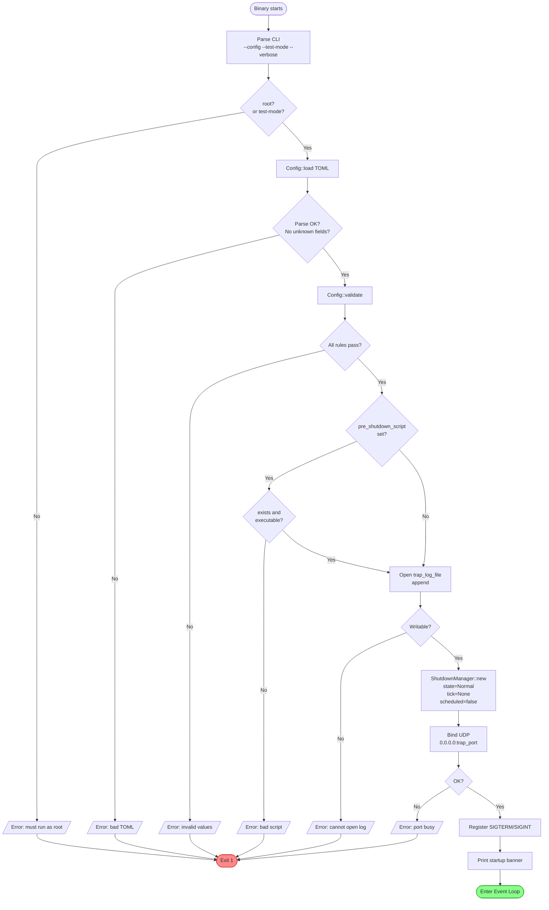
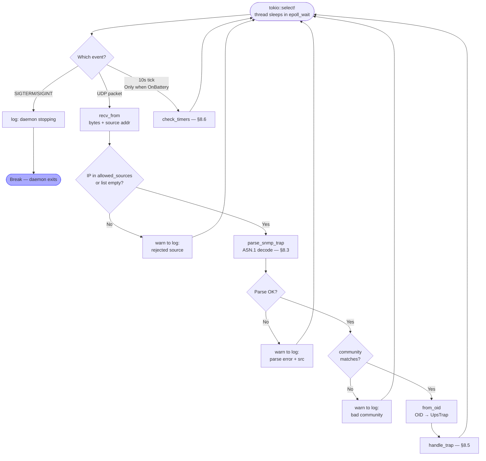
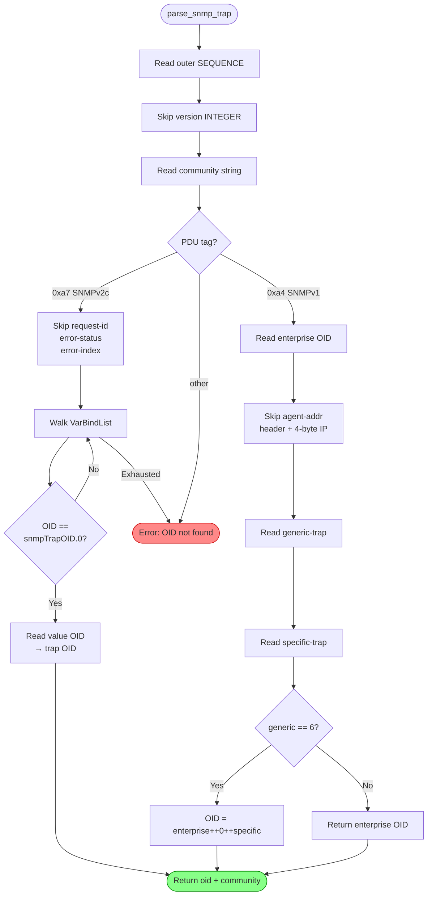
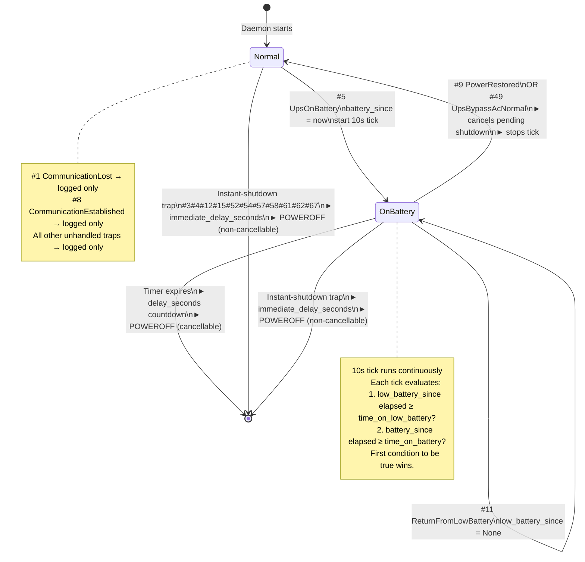
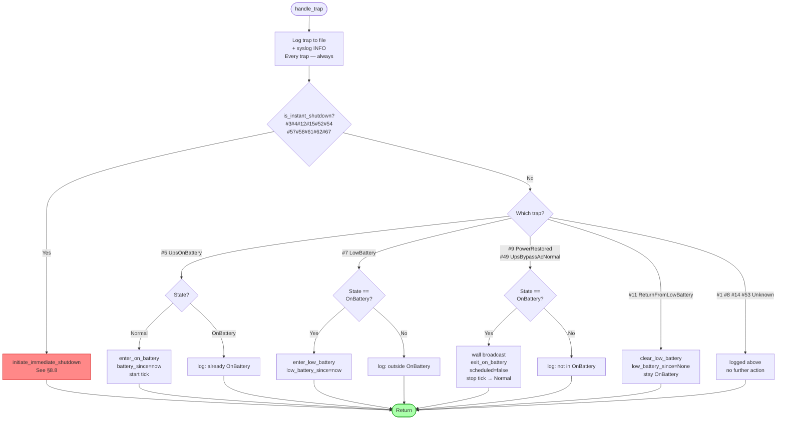
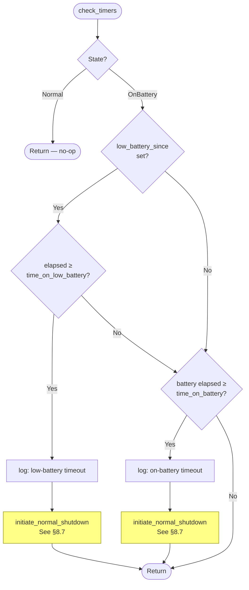
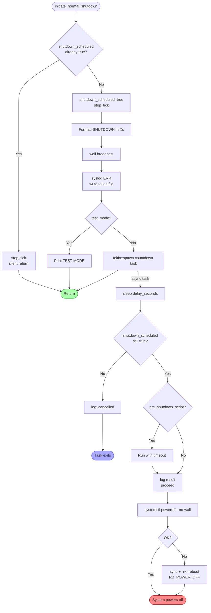
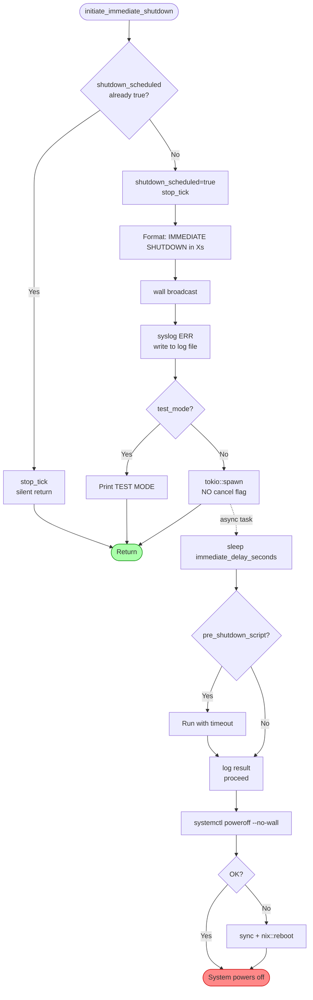

# ups-shutdown-daemon

**Version:** 1.3.0 &nbsp;|&nbsp; **Platform:** CentOS 7 / 8 / 9 (RHEL-compatible) &nbsp;|&nbsp; **Language:** Rust 2021  
**UPS:** PPC / Upsmate series &nbsp;|&nbsp; **Protocol:** SNMP v1 / v2c &nbsp;|&nbsp; **Enterprise OID:** `1.3.6.1.4.1.935`

A lightweight daemon that receives SNMP traps from a PPC/Upsmate UPS and performs a
clean, ordered server shutdown before battery power is exhausted or a hardware fault
causes an uncontrolled crash.

---

## Table of Contents

1. [Overview](#1-overview)
2. [Source Files](#2-source-files)
3. [Compilation](#3-compilation)
4. [Installation as a systemd Service](#4-installation-as-a-systemd-service)
5. [Configuration](#5-configuration)
6. [Testing with send-ups-traps.py](#6-testing-with-send-ups-trapspy)
7. [UPS Trap Reference](#7-ups-trap-reference)
8. [Program Logic — Flowcharts](#8-program-logic--flowcharts)
9. [Security Model](#9-security-model)
10. [Log File Reference](#10-log-file-reference)
11. [CLI Reference](#11-cli-reference)
12. [Troubleshooting](#12-troubleshooting)

---

## 1. Overview

```
UPS Device  ──SNMP trap──►  ups-shutdown-daemon  ──►  systemctl poweroff
(battery low,                (parses, classifies,       (clean systemd
 hardware fault)              decides, times)            shutdown)
```

The daemon listens on **UDP port 162** for SNMP trap packets from the UPS. Every received
packet is written to a persistent log file. Depending on the trap number the daemon
transitions between two operating states and triggers a shutdown when configured
thresholds are exceeded.

### Key design properties

- **Zero CPU usage while idle** — single-threaded async runtime (`current_thread` Tokio
  flavour) parks in `epoll_wait`; woken only by the kernel on UDP arrival or timer expiry
- **Two shutdown paths** — *normal* (timer-based, cancellable countdown) and *immediate*
  (hardware fault, non-cancellable)
- **Two independent battery timers** — `time_on_battery` and `time_on_low_battery`;
  whichever expires first wins
- **Community string + source-IP authentication** — traps from unknown hosts or with a
  wrong community string are dropped and logged
- **`systemctl poweroff`** for clean systemd shutdown; raw kernel reboot as fallback
- **Optional pre-shutdown script** with a configurable hard timeout

---

## 2. Source Files

| File | Purpose |
|------|---------|
| `src/main.rs` | All daemon logic: trap parsing, state machine, shutdown |
| `src/config.rs` | Config struct definitions and startup validation |
| `config.toml` | Runtime configuration (copy to `/etc/ups-shutdown/`) |
| `Cargo.toml` | Rust package manifest and dependencies |
| `send-ups-traps.py` | Python test tool — sends any MIB trap via UDP |

### Dependencies (Cargo.toml)

| Crate | Version | Purpose |
|-------|---------|---------|
| `tokio` | 1.35 | Async runtime, UDP socket, timers |
| `syslog` | 6.1 | Write to system journal via LOG_DAEMON |
| `chrono` | 0.4 | Timestamps in log file entries |
| `serde` + `toml` | 1.0 / 0.8 | TOML config deserialization |
| `anyhow` | 1.0 | Ergonomic error handling |
| `clap` | 4.4 | CLI argument parsing |
| `nix` | 0.27 | Raw kernel reboot fallback, UID check |
| `signal-hook-tokio` | 0.3 | Async SIGTERM / SIGINT handling |
| `futures` | 0.3 | `OptionFuture` for conditional timer branch |

---

## 3. Compilation

### Prerequisites

```bash
# Install Rust (if not already present)
curl --proto '=https' --tlsv1.2 -sSf https://sh.rustup.rs | sh
source ~/.cargo/env
rustc --version   # should be >= 1.70
```

### Build

```bash
cd ups-shutdown-daemon

# Debug build (faster compile, larger binary)
cargo build

# Release build — optimised, LTO, debug symbols stripped
cargo build --release
```

The release binary is at `target/release/ups-shutdown-daemon` (~1 MB stripped).

The release profile in `Cargo.toml` is already tuned:

```toml
[profile.release]
opt-level     = 3    # maximum optimisation
lto           = true  # link-time optimisation across all crates
codegen-units = 1    # single codegen unit for best inlining
strip         = true  # strip debug symbols from binary
```

---

## 4. Installation as a systemd Service

### Install binary and config

```bash
# Install binary
install -m 755 target/release/ups-shutdown-daemon /usr/local/sbin/

# Create config directory
mkdir -p /etc/ups-shutdown
cp config.toml /etc/ups-shutdown/config.toml
chmod 600 /etc/ups-shutdown/config.toml
chown root:root /etc/ups-shutdown/config.toml

# Create log file
touch /var/log/ups-traps.log
chmod 640 /var/log/ups-traps.log
chown root:root /var/log/ups-traps.log
```

### systemd unit file

Create `/etc/systemd/system/ups-shutdown.service`:

```ini
[Unit]
Description=UPS SNMP Trap Shutdown Daemon (PPC/Upsmate)
After=network.target syslog.target
Wants=network.target

[Service]
Type=simple
ExecStart=/usr/local/sbin/ups-shutdown-daemon --config /etc/ups-shutdown/config.toml
Restart=always
RestartSec=5
StandardOutput=journal
StandardError=journal
User=root
CapabilityBoundingSet=CAP_NET_BIND_SERVICE CAP_SYS_BOOT

[Install]
WantedBy=multi-user.target
```

### Enable and start

```bash
systemctl daemon-reload
systemctl enable ups-shutdown
systemctl start ups-shutdown
systemctl status ups-shutdown
```

### Verify it is running

```bash
# Live logs
journalctl -u ups-shutdown -f

# Confirm UDP/162 is bound
ss -ulnp | grep 162
```

Expected startup output:

```
ups-shutdown-daemon v1.3.0 starting
  Config              : /etc/ups-shutdown/config.toml
  Port                : 162
  time_on_battery     : 300s
  time_on_low_battery : 60s
  delay_seconds       : 30s (normal shutdown countdown)
  immediate_delay     : 5s (instant-shutdown traps)
  Test mode           : false
  Verbose             : false
Ready — listening for SNMP traps.
```

### Log rotation

Create `/etc/logrotate.d/ups-traps`:

```
/var/log/ups-traps.log {
    weekly
    rotate 52
    compress
    missingok
    notifempty
    create 0640 root root
}
```

### SELinux (CentOS 8/9 enforcing)

```bash
# Option A — label the binary
semanage fcontext -a -t bin_t /usr/local/sbin/ups-shutdown-daemon
restorecon -v /usr/local/sbin/ups-shutdown-daemon

# Option B — use unprivileged port + redirect
# Set trap_port = 1162 in config.toml, then:
firewall-cmd --add-forward-port=port=162:proto=udp:toport=1162 --permanent
firewall-cmd --reload
```

---

## 5. Configuration

**File:** `/etc/ups-shutdown/config.toml`

Unknown keys cause a hard error at startup (`deny_unknown_fields`) — typos are caught
immediately rather than silently ignored.

### [snmp]

| Key | Type | Description |
|-----|------|-------------|
| `trap_port` | integer | UDP port to listen on. Port 162 requires root. |
| `community_string` | string | **Required.** Must match the SNMP community string set on the UPS. Every incoming trap is verified; mismatches are dropped and logged. |
| `allowed_sources` | IP array | If non-empty, packets from unlisted IPs are dropped before parsing. `[]` accepts from any source. |

### [shutdown]

| Key | Type | Default | Description |
|-----|------|---------|-------------|
| `time_on_battery` | seconds | — | How long the UPS may run on battery (from trap **#5**) before a normal shutdown. Min 10. |
| `time_on_low_battery` | seconds | — | How long after trap **#7** (low battery) is received while on battery before a normal shutdown. Must be ≤ `time_on_battery`. Min 5. |
| `delay_seconds` | seconds | — | Graceful user-facing countdown before poweroff. Broadcast via `wall`. Cancellable if recovery trap arrives in time. |
| `immediate_delay_seconds` | seconds | `5` | Short countdown for hardware-fault traps. **Non-cancellable.** |
| `pre_shutdown_script` | string | absent | Absolute path to script run just before poweroff. Validated at startup. |
| `script_timeout_seconds` | seconds | `25` | Hard deadline for pre_shutdown_script. |

### [logging]

| Key | Type | Default | Description |
|-----|------|---------|-------------|
| `trap_log_file` | string | — | Append-only file for all trap events and decisions. |
| `verbose` | bool | `false` | Mirror log lines to stdout. Same as `--verbose`. |

### Full annotated example

```toml
[snmp]
trap_port        = 162
community_string = "my_strong_secret"   # change this!
allowed_sources  = ["192.168.1.10"]     # UPS management IP only

[shutdown]
time_on_battery       = 300   # shut down after 5 min on battery
time_on_low_battery   = 60    # shut down 1 min after low-battery warning
delay_seconds         = 30    # 30s countdown displayed to logged-in users
immediate_delay_seconds = 5   # 5s before poweroff on hardware faults
script_timeout_seconds  = 25
# pre_shutdown_script = "/usr/local/bin/pre-shutdown.sh"

[logging]
trap_log_file = "/var/log/ups-traps.log"
verbose       = false
```

### Startup validation rules

| Rule | Reason |
|------|--------|
| `community_string` non-empty | Empty string disables all authentication |
| `time_on_battery` ≥ 10 | Prevents accidental instant shutdown on trap #5 |
| `time_on_low_battery` ≥ 5 | Minimum meaningful timer |
| `time_on_low_battery` ≤ `time_on_battery` | Low-battery must be a sub-interval |
| `delay_seconds` > 0 | At least 1 second for users to see the wall message |
| `script_timeout_seconds` > 0 | A zero timeout would make the script run forever |
| If script set: exists and executable | Prevent silent no-op on poweroff |

---

## 6. Testing with send-ups-traps.py

`send-ups-traps.py` is an interactive Python script that builds raw SNMPv2c packets and
sends them to the daemon over UDP. It covers all 70 traps in the PPC/Upsmate MIB.

### Setup

```bash
python3 --version   # Python 3.6+ required, no packages to install
```

Edit the three constants at the top of `send-ups-traps.py`:

```python
TARGET_IP   = '127.0.0.1'   # IP running ups-shutdown-daemon
TARGET_PORT = 162            # must match snmp.trap_port in config.toml
COMMUNITY   = b'public'      # must match snmp.community_string in config.toml
```

> **Important:** The script defaults to `b'public'`. Your config.toml likely has a
> different `community_string`. Update `COMMUNITY` in the script to match, or the
> daemon will reject every packet.

### Run the test

Always start the daemon in test mode first so no actual poweroff can occur:

```bash
# Terminal 1 — start daemon in test mode
ups-shutdown-daemon --test-mode --verbose --config /etc/ups-shutdown/config.toml

# Terminal 2 — run the test tool
python3 send-ups-traps.py
```

### Menu

```
===========================================================================
      UPSMATE (2).MIB - CORRECTED RAW TRAP SENDER
===========================================================================
 1) Communication to the UPS has been  | 36) Security4 Alarm
 2) UPS overload                        | 37) Security5 Alarm
 3) The UPS failed its internal diagno  | 38) Security6 Alarm
...
===========================================================================
 0) Send ALL Traps | q) Quit

Select Trap ID:
```

Enter a trap number to send that single trap, or `0` to fire all 70 in sequence
with 50 ms spacing.

### Test scenarios

**Scenario 1 — Normal on-battery shutdown**

Set `time_on_battery = 30` and `delay_seconds = 10` in config for speed.

```
Send: 5    → STATE → OnBattery, battery timer starts
Wait ~30s  → "On-battery timeout: 30s >= 30s — normal shutdown"
           → "SHUTDOWN in 10s — OnBattery timeout [...]"
           → "TEST MODE: would poweroff after 10s"
```

**Scenario 2 — Low-battery accelerated shutdown**

Set `time_on_battery = 120`, `time_on_low_battery = 20`, `delay_seconds = 10`.

```
Send: 5    → OnBattery state
Send: 7    → low-battery sub-timer starts
Wait ~20s  → low-battery timer fires first
           → "SHUTDOWN in 10s — LowBattery timeout"
```

**Scenario 3 — Power restored (cancellation)**

```
Send: 5    → OnBattery state
Wait 10s   (less than time_on_battery)
Send: 9    → "STATE → Normal: PowerRestored — cancelling any pending shutdown"
```

Send `49` (Bypass AC Normal) for the same cancellation effect.

**Scenario 4 — Return from low battery (sub-timer cleared)**

```
Send: 5    → OnBattery state
Send: 7    → low-battery sub-timer starts
Send: 11   → "OnBattery: low-battery timer cleared (ReturnFromLowBattery)"
           → daemon stays in OnBattery, only battery timer continues
```

**Scenario 5 — Instant hardware fault**

```
Send: 58   → "Instant-shutdown trap: #58 Emergency Stop"
           → "IMMEDIATE SHUTDOWN in 5s — ..."
           → "TEST MODE: would poweroff immediately after 5s"
           → non-cancellable — no recovery trap stops this
```

Other instant-shutdown traps to test: **3, 4, 12, 15, 52, 54, 57, 61, 62, 67**.

**Scenario 6 — Full logging audit**

```
Send: 0    → all 70 traps fired with 50ms spacing
```

Then inspect `/var/log/ups-traps.log` — every trap number should appear. Traps not
handled (environmental sensors, security alarms, etc.) are logged and silently ignored.

### Expected output samples

Normal on-battery timeout:
```
Received 94 bytes from 127.0.0.1:41234
OID: 1.3.6.1.4.1.935.0.5
Trap #5 (On Battery) from 127.0.0.1:41234
STATE → OnBattery: on-battery timer started
[... 30s later ...]
On-battery timeout: 30s >= time_on_battery=30s — normal shutdown
SHUTDOWN in 10s — OnBattery timeout [2026-02-15 09:01:00]
TEST MODE: would poweroff after 10s
```

Power restored:
```
Trap #9 (Power Restored) from 127.0.0.1:41235
STATE → Normal: PowerRestored — cancelling any pending shutdown
```

Hardware fault:
```
Trap #58 (Emergency Stop) from 127.0.0.1:41236
Instant-shutdown trap: #58 Emergency Stop
IMMEDIATE SHUTDOWN in 5s — Instant-shutdown trap: #58 Emergency Stop [...]
TEST MODE: would poweroff immediately after 5s
```

---

## 7. UPS Trap Reference

Enterprise OID: `1.3.6.1.4.1.935`

### Category A — Instant shutdown (non-cancellable)

Acted on regardless of current state. `immediate_delay_seconds` countdown is immediate
and cannot be stopped by any recovery trap.

| # | Description |
|---|-------------|
| 3 | UPS failed internal self-test |
| 4 | Runtime calibration discharge |
| 12 | Turned off by management command |
| 15 | Reboot sequence started |
| 52 | Scheduled shutdown |
| 54 | Short circuit shutdown |
| 57 | High DC shutdown |
| 58 | Emergency Stop (physical E-STOP) |
| 61 | Over temperature shutdown |
| 62 | Overload shutdown |
| 67 | Low battery shutdown (UPS itself shutting down) |

### Category B — State transitions

| # | Description | Action |
|---|-------------|--------|
| 5 | On Battery | → **OnBattery** state; `battery_since` timer starts; 10s tick activates |
| 7 | Battery Low | While OnBattery: `low_battery_since` sub-timer starts |

### Category C — Recovery / cancel

| # | Description | Action |
|---|-------------|--------|
| 9 | Power Restored | Exits OnBattery → Normal; cancels any pending normal shutdown |
| 49 | Bypass AC Normal | Same as #9 |
| 11 | Return from Low Battery | Clears `low_battery_since` sub-timer; stays OnBattery |

### Category D — Informational (logged only, no action)

| # | Description |
|---|-------------|
| 1 | Communication Lost — logged only (trap not reliably received) |
| 8 | Communication Established — logged only |
| 14 | Woke Up |
| 53 | Return from Bypass Mode |

### Category E — Logged and ignored

All other trap numbers (environmental sensors, security alarms, capacity readings, etc.)
are written to the log file and produce no state change or shutdown.

Examples: #2 overload warning, #6/#68 boost enabled/return, #10 self-test passed,
#13 sleep mode, #16–#31 temperature/humidity/smoke/water/gas sensors,
#33–#39 security alarms, #47–#48 rectifier/bypass faults, #50–#51 bypass/test,
#55–#56 inverter/bypass shutdown, #59–#60 static switch, #63–#64 capacity,
#69–#70 buck/boost return.

---

## 8. Program Logic — Flowcharts

### 8.1 Startup & Initialisation



---

### 8.2 Main Event Loop



---

### 8.3 SNMP Packet Parsing



---

### 8.4 State Machine



---

### 8.5 Trap Dispatcher (`handle_trap`)



---

### 8.6 Periodic Timer Check (`check_timers`)

Called every 10 seconds. Tick is **only active in OnBattery state** and stops the
moment shutdown is committed.



---

### 8.7 Normal Shutdown Sequence

Triggered by timer expiry. **Cancellable** if trap #9 or #49 arrives within `delay_seconds`.



---

### 8.8 Immediate Shutdown Sequence

Triggered by hardware-fault traps. **Non-cancellable.**



---

## 9. Security Model

### Authentication pipeline

```
UDP packet arrives
        │
        ▼
┌───────────────────────────────────────────────┐
│  Gate 1 — Source IP                           │
│  src.ip() ∈ allowed_sources                   │
│  OR allowed_sources = []                      │
│  Checked before any parsing                   │
│  Rejected → warn to log                       │
└───────────────────────────────────────────────┘
        │ pass
        ▼
┌───────────────────────────────────────────────┐
│  ASN.1 parse                                  │
│  Malformed frames → warn to log, drop         │
└───────────────────────────────────────────────┘
        │ pass
        ▼
┌───────────────────────────────────────────────┐
│  Gate 2 — Community String                    │
│  parsed.community == community_string         │
│  Mismatch → warn to log, drop                 │
└───────────────────────────────────────────────┘
        │ pass
        ▼
    handle_trap()
```

### Production hardening

```bash
# Strong community string
openssl rand -base64 16

# Protect config file
chmod 600 /etc/ups-shutdown/config.toml

# Restrict UDP/162 to UPS IP at firewall
firewall-cmd --add-rich-rule='rule family="ipv4" source address="192.168.1.10" \
  port port="162" protocol="udp" accept' --permanent
firewall-cmd --add-rich-rule='rule family="ipv4" \
  port port="162" protocol="udp" drop' --permanent
firewall-cmd --reload

# Match in config.toml
# allowed_sources = ["192.168.1.10"]
```

---

## 10. Log File Reference

All entries use the format: `[YYYY-MM-DD HH:MM:SS] <message>`

### Normal on-battery shutdown

```
[2026-02-15 09:00:00] Trap #5 (On Battery) from 192.168.1.10:1234
[2026-02-15 09:00:00] STATE → OnBattery: on-battery timer started
[2026-02-15 09:05:00] On-battery timeout: 300s >= time_on_battery=300s — normal shutdown
[2026-02-15 09:05:00] SHUTDOWN in 30s — OnBattery timeout [2026-02-15 09:05:00]
```

### Low-battery accelerated shutdown

```
[2026-02-15 09:00:00] Trap #5 (On Battery) from 192.168.1.10:1234
[2026-02-15 09:00:00] STATE → OnBattery: on-battery timer started
[2026-02-15 09:02:00] Trap #7 (Low Battery) from 192.168.1.10:1235
[2026-02-15 09:02:00] OnBattery+LowBattery: low-battery timer started
[2026-02-15 09:03:00] Low-battery timeout: 60s >= time_on_low_battery=60s — normal shutdown
[2026-02-15 09:03:00] SHUTDOWN in 30s — LowBattery timeout [2026-02-15 09:03:00]
```

### Power restored (shutdown cancelled)

```
[2026-02-15 09:00:00] Trap #5 (On Battery) from 192.168.1.10:1234
[2026-02-15 09:00:00] STATE → OnBattery: on-battery timer started
[2026-02-15 09:01:30] Trap #9 (Power Restored) from 192.168.1.10:1236
[2026-02-15 09:01:30] STATE → Normal: PowerRestored — cancelling any pending shutdown
```

### Instant hardware fault

```
[2026-02-15 10:00:00] Trap #58 (Emergency Stop) from 192.168.1.10:1300
[2026-02-15 10:00:00] Instant-shutdown trap: #58 Emergency Stop
[2026-02-15 10:00:00] IMMEDIATE SHUTDOWN in 5s — Instant-shutdown trap: #58 [...]
```

### Rejected packets

```
[2026-02-15 11:00:00] Rejected: source 10.0.0.99:5000 not in allowed_sources
[2026-02-15 11:00:05] Rejected: bad community 'public' from 192.168.1.10:1400
[2026-02-15 11:00:10] Parse error from 192.168.1.10:1401: Truncated ASN.1 at ...
```

---

## 11. CLI Reference

```
USAGE:
    ups-shutdown-daemon [OPTIONS]

OPTIONS:
    -c, --config <PATH>    Config file path
                           [default: /etc/ups-shutdown/config.toml]

    -t, --test-mode        Dry-run: log all decisions, no actual poweroff.
                           Does not require root. Use with send-ups-traps.py.

    -v, --verbose          Print every trap, OID, and state change to stdout.
                           Also enabled by logging.verbose = true in config.

    -h, --help             Print help

SIGNALS:
    SIGTERM / SIGINT       Stop the daemon cleanly — no shutdown triggered.
```

---

## 12. Troubleshooting

### All traps rejected — "bad community"

`community_string` in `config.toml` must exactly match `COMMUNITY` in `send-ups-traps.py`
and the setting on the physical UPS. The script defaults to `b'public'`, the example
config uses `"ups_secret"` — they must be identical.

```bash
grep community_string /etc/ups-shutdown/config.toml
grep COMMUNITY send-ups-traps.py
```

### All traps rejected — "not in allowed_sources"

Either add the sender IP to `allowed_sources` or set `allowed_sources = []`.

### No packets appearing in log at all

```bash
# Is the daemon running?
systemctl status ups-shutdown

# Is it bound to the port?
ss -ulnp | grep 162

# Are packets arriving at the host?
tcpdump -i any -n udp port 162

# Is firewalld blocking them?
firewall-cmd --list-all
```

### Shutdown fires immediately on trap #5

`time_on_battery` is too small. Minimum is 10 seconds. Check the config path in the
startup banner matches the file you edited.

### Shutdown message appears twice on terminal

Should not occur in v1.3.0. Each shutdown path calls `wall` once. If it recurs,
check that `verbose = false` in config (verbose mode prints to stdout which, if
running in a terminal, shows alongside the wall broadcast).

### `systemctl poweroff` fails

Check `ps -p 1 -o comm=` — must be `systemd`. In containers or minimal installs
the raw `nix::reboot(RB_POWER_OFF)` fallback handles the poweroff regardless.

### Cannot bind UDP port 162

Requires root or `CAP_NET_BIND_SERVICE`. Alternatives:

```bash
# Use an unprivileged port + redirect
# Set trap_port = 1162 in config.toml, then:
firewall-cmd --add-forward-port=port=162:proto=udp:toport=1162 --permanent

# Or grant the capability directly to the binary
setcap cap_net_bind_service=ep /usr/local/sbin/ups-shutdown-daemon
```
