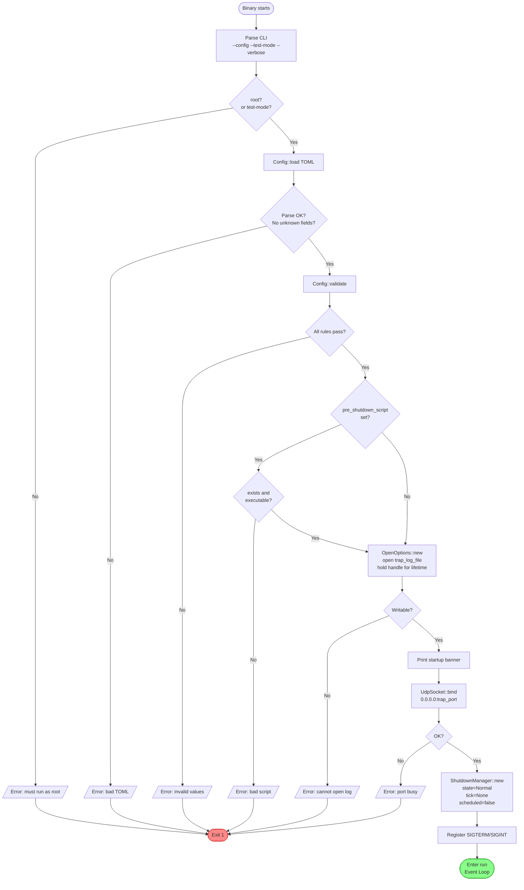
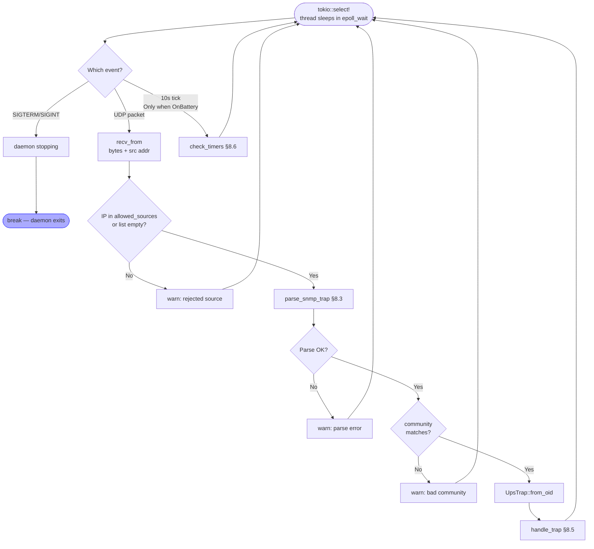
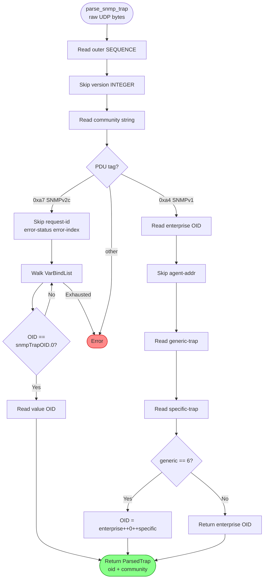
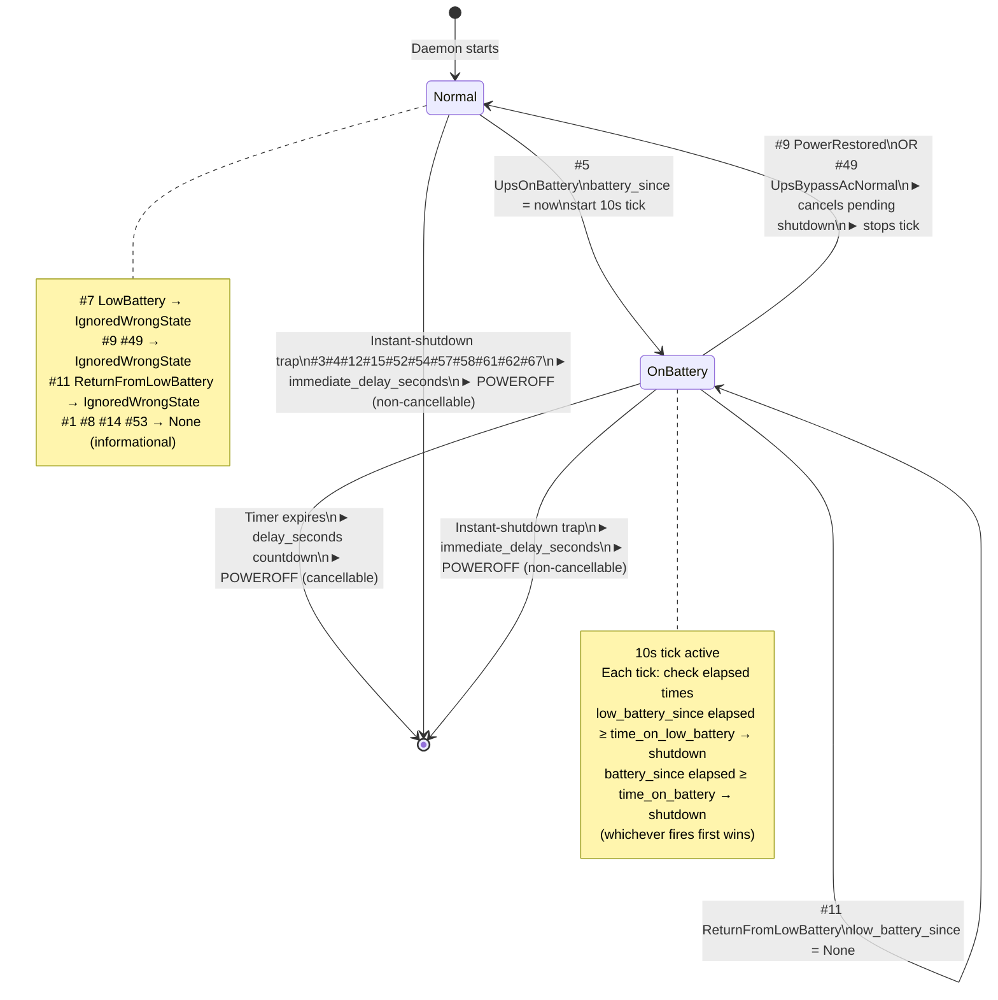
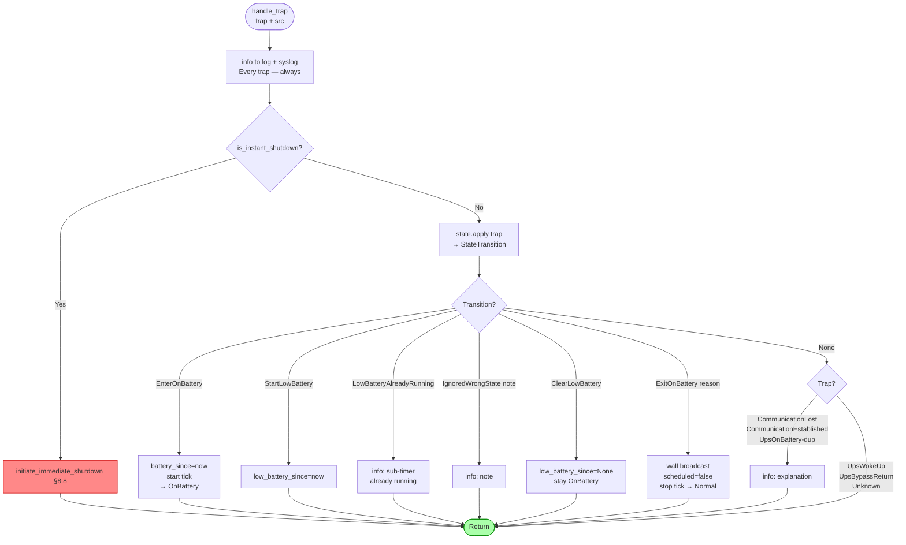
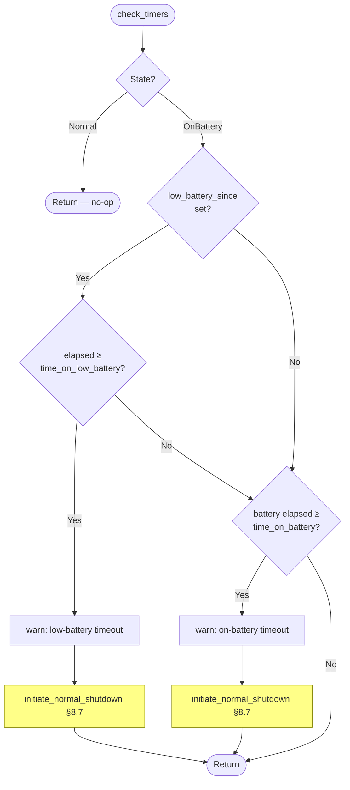
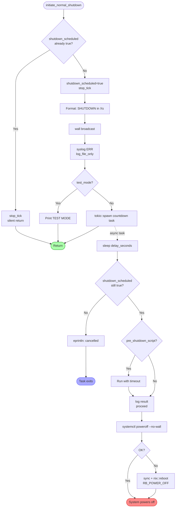
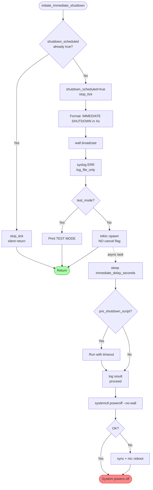

# ups-shutdown-daemon

**Version:** 1.4.0 &nbsp;|&nbsp; **Edition:** Rust 2021 &nbsp;|&nbsp; **Platform:** CentOS 7 / 8 / 9 (RHEL-compatible)  
**UPS:** PPC / Upsmate series &nbsp;|&nbsp; **Protocol:** SNMP v1 / v2c &nbsp;|&nbsp; **Enterprise OID:** `1.3.6.1.4.1.935`

A lightweight daemon that receives SNMP traps from a PPC/Upsmate UPS and performs a
clean, ordered server shutdown before battery power is exhausted or a hardware fault
causes an uncontrolled crash.

---

## Table of Contents

1. [Overview](#1-overview)
2. [Source Layout](#2-source-layout)
3. [Compilation](#3-compilation)
4. [Installation as a systemd Service](#4-installation-as-a-systemd-service)
5. [Configuration](#5-configuration)
6. [Testing with send-ups-traps.py](#6-testing-with-send-ups-trapspy)
7. [UPS Trap Reference](#7-ups-trap-reference)
8. [Program Logic — Flowcharts](#8-program-logic--flowcharts)
   - 8.1 [Startup & Initialisation](#81-startup--initialisation)
   - 8.2 [Main Event Loop](#82-main-event-loop)
   - 8.3 [SNMP Packet Parsing](#83-snmp-packet-parsing)
   - 8.4 [State Machine](#84-state-machine)
   - 8.5 [StateTransition dispatch](#85-statetransition-dispatch)
   - 8.6 [Periodic Timer Check](#86-periodic-timer-check)
   - 8.7 [Normal Shutdown Sequence](#87-normal-shutdown-sequence)
   - 8.8 [Immediate Shutdown Sequence](#88-immediate-shutdown-sequence)
9. [Security Model](#9-security-model)
10. [Log File Reference](#10-log-file-reference)
11. [CLI Reference](#11-cli-reference)
12. [Troubleshooting](#12-troubleshooting)

---

## 1. Overview

```
UPS Device  ──SNMP trap──►  ups-shutdown-daemon  ──►  systemctl poweroff
(battery low,                (parses, classifies,       (clean systemd
 hardware fault)              decides, times)            shutdown)
```

The daemon listens on **UDP port 162** for SNMP trap packets from the UPS.
Every received packet is written to a persistent log file. Depending on the
trap number the daemon transitions between two operating states and triggers a
shutdown when configured thresholds are exceeded.

### Key design properties

- **Zero CPU usage while idle** — `current_thread` Tokio runtime parks in
  `epoll_wait`; woken only by the kernel on UDP arrival or timer expiry
- **Two shutdown paths** — *normal* (timer-based, cancellable countdown) and
  *immediate* (hardware fault, non-cancellable)
- **Two independent battery timers** — `time_on_battery` and
  `time_on_low_battery`; whichever expires first wins
- **Community string + source-IP authentication** — packets from unknown hosts
  or with a wrong community string are dropped and logged
- **`systemctl poweroff`** for clean systemd shutdown; raw kernel reboot as
  fallback
- **`wall` is non-blocking** — all broadcast calls use `tokio::process::Command`
  so the async event loop is never blocked waiting for `wall` to finish
- **Log file held open** — the trap log is opened once at startup and kept open
  for the daemon lifetime; no `open()`/`close()` syscall pair per log line
- **State owns its transitions** — `UpsState::apply()` decides what a trap
  means in context; `ShutdownManager` executes the decision; the two concerns
  are cleanly separated

---

## 2. Source Layout

```
src/
  main.rs      CLI args, init(), run() — 187 lines
  config.rs    Config structs and startup validation — 126 lines
  trap.rs      UpsTrap enum, UpsState, StateTransition — 227 lines
  snmp.rs      Pure ASN.1 / SNMP parsing — 131 lines
  manager.rs   ShutdownManager: logging, dispatch, shutdown — 364 lines
config.toml                  Annotated example configuration
Cargo.toml                  Package manifest and dependencies
ups-shutdown-daemon.service systemd unit file
send-ups-traps.py           Interactive trap test tool
ups-traps.logrotate         logrotate config (copytruncate for held-open handle)
```

### Module responsibilities

**`trap.rs`** contains all domain knowledge: the trap enum, the two-state
machine, and `StateTransition` — the typed result that `UpsState::apply()`
returns. No I/O, no side effects.

**`snmp.rs`** contains only packet parsing. Pure functions: bytes in,
`ParsedTrap` out. No daemon state, no logging.

**`manager.rs`** contains `ShutdownManager` — the only stateful component. It
owns the log file handle, the syslog connection, the state machine instance,
the tick timer, and the `shutdown_scheduled` flag. All side effects (logging,
`wall`, `systemctl`) are here.

**`main.rs`** is a thin entry point: `init()` validates the environment and
opens resources; `run()` drives the event loop. No business logic.

### Dependencies (Cargo.toml)

| Crate | Version | Purpose |
|-------|---------|---------|
| `tokio` | 1.35 | Async runtime, UDP socket, timers (`current_thread` only) |
| `syslog` | 6.1 | Write to system journal via LOG_DAEMON |
| `chrono` | 0.4 (`clock` feature only) | Timestamps in log file entries |
| `serde` + `toml` | 1.0 / 0.8 | TOML config deserialization |
| `anyhow` | 1.0 | Ergonomic error handling |
| `clap` | 4.4 | CLI argument parsing |
| `nix` | 0.27 (`reboot`, `user`, `fs`) | `sync()`, `Uid::effective()`, raw kernel reboot |
| `signal-hook-tokio` | 0.3 | Async SIGTERM / SIGINT handling |
| `futures` | 0.3 | `OptionFuture` for conditional tick branch |

### Release profile

```toml
[profile.release]
opt-level     = 3       # maximum optimisation
lto           = true    # link-time optimisation across all crates
codegen-units = 1       # single codegen unit for best inlining
strip         = true    # strip debug symbols
panic         = "abort" # no stack unwinding — systemd Restart=always recovers
```

`panic = "abort"` is correct for a daemon: if a panic occurs, the process dies
immediately and systemd restarts it within 5 seconds. Unwinding destructors in
a corrupt process is pointless and wastes time.

---

## 3. Compilation

### Prerequisites

```bash
curl --proto '=https' --tlsv1.2 -sSf https://sh.rustup.rs | sh
source ~/.cargo/env
rustc --version   # >= 1.70 required
```

### Build

```bash
cd ups-shutdown-daemon
cargo build --release
```

Binary: `target/release/ups-shutdown-daemon` (~1 MB stripped).

---

## 4. Installation as a systemd Service

### Install binary and config

```bash
install -m 755 target/release/ups-shutdown-daemon /usr/local/sbin/

mkdir -p /etc/ups-shutdown
cp config.toml /etc/ups-shutdown/config.toml
chmod 600 /etc/ups-shutdown/config.toml
chown root:root /etc/ups-shutdown/config.toml

touch /var/log/ups-traps.log
chmod 640 /var/log/ups-traps.log
chown root:root /var/log/ups-traps.log
```

### systemd unit file

Create `/etc/systemd/system/ups-shutdown-daemon.service`:

```bash
cp ups-shutdown-daemon.service /etc/systemd/system/
```

Or create manually:

```ini
[Unit]
Description=UPS SNMP Trap Shutdown Daemon (PPC/Upsmate)
After=network.target syslog.target
Wants=network.target

[Service]
Type=simple
ExecStart=/usr/local/sbin/ups-shutdown-daemon --config /etc/ups-shutdown/config.toml
Restart=always
RestartSec=5
StandardOutput=journal
StandardError=journal
User=root
CapabilityBoundingSet=CAP_NET_BIND_SERVICE CAP_SYS_BOOT

[Install]
WantedBy=multi-user.target
```

### Enable and start

```bash
systemctl daemon-reload
systemctl enable ups-shutdown-daemon
systemctl start ups-shutdown-daemon
systemctl status ups-shutdown-daemon
journalctl -u ups-shutdown-daemon -f
ss -ulnp | grep 162
```

### Expected startup output

```
ups-shutdown-daemon v1.4.0 starting
  Config              : /etc/ups-shutdown/config.toml
  Port                : 162
  time_on_battery     : 300s
  time_on_low_battery : 60s
  delay_seconds       : 30s (normal shutdown countdown)
  immediate_delay     : 5s (instant-shutdown traps)
  Test mode           : false
  Verbose             : false
Ready — listening for SNMP traps.
```

### Log rotation

The daemon holds the log file open permanently. Standard logrotate would
rename the file and keep writing to the old inode. Use `copytruncate` to
truncate the file in-place instead:

```bash
cp ups-traps.logrotate /etc/logrotate.d/ups-traps
```

Contents of `ups-traps.logrotate` (included in the zip):

```
/var/log/ups-traps.log {
    weekly
    rotate 52
    compress
    copytruncate
    missingok
    notifempty
    create 0640 root root
}
```

`copytruncate` has a small copy-then-truncate window where a log line could
be lost. For a UPS trap log that sees a handful of events per year this is
acceptable. The alternative is a SIGHUP handler that reopens the file.

### SELinux (CentOS 8/9 enforcing)

```bash
# Option A — label the binary
semanage fcontext -a -t bin_t /usr/local/sbin/ups-shutdown-daemon
restorecon -v /usr/local/sbin/ups-shutdown-daemon

# Option B — unprivileged port + redirect
# Set trap_port = 1162 in config.toml, then:
firewall-cmd --add-forward-port=port=162:proto=udp:toport=1162 --permanent
firewall-cmd --reload
```

---

## 5. Configuration

**File:** `/etc/ups-shutdown/config.toml`

The daemon uses `deny_unknown_fields` — any unrecognised key causes a hard
error at startup rather than being silently ignored.

### [snmp]

| Key | Type | Description |
|-----|------|-------------|
| `trap_port` | integer | UDP port to listen on. Port 162 requires root. |
| `community_string` | string | **Required.** Must match the SNMP community string set on the UPS. Checked on every packet. |
| `allowed_sources` | IP array | If non-empty, packets from unlisted IPs are dropped before parsing. `[]` accepts from any source. |

### [shutdown]

| Key | Type | Description |
|-----|------|-------------|
| `time_on_battery` | seconds | How long on battery (from trap **#5**) before normal shutdown. Min 10. |
| `time_on_low_battery` | seconds | How long after trap **#7** before normal shutdown. Must be ≤ `time_on_battery`. Min 5. |
| `delay_seconds` | seconds | Cancellable countdown broadcast via `wall` before poweroff. |
| `immediate_delay_seconds` | seconds | Non-cancellable countdown for hardware-fault traps. |
| `pre_shutdown_script` | string | Absolute path to script run just before poweroff. Validated at startup. |
| `script_timeout_seconds` | seconds | Hard deadline for pre_shutdown_script. |

### [logging]

| Key | Type | Description |
|-----|------|-------------|
| `trap_log_file` | string | Append-only file for all trap events and decisions. Opened once at startup. |
| `verbose` | bool | Mirror log lines to stdout. Same as `--verbose`. |

### Full annotated example

```toml
[snmp]
trap_port        = 162
community_string = "my_strong_secret"
allowed_sources  = ["192.168.1.10"]

[shutdown]
time_on_battery         = 300
time_on_low_battery     = 60
delay_seconds           = 30
immediate_delay_seconds = 5
script_timeout_seconds  = 25
# pre_shutdown_script   = "/usr/local/bin/pre-shutdown.sh"

[logging]
trap_log_file = "/var/log/ups-traps.log"
verbose       = false
```

---

## 6. Testing with send-ups-traps.py

`send-ups-traps.py` builds raw SNMPv2c packets and sends them over UDP. It
covers all 70 traps in the PPC/Upsmate MIB.

### Setup

```bash
python3 --version   # 3.6+ required, no extra packages
```

Edit the three constants at the top:

```python
TARGET_IP   = '127.0.0.1'   # host running ups-shutdown-daemon
TARGET_PORT = 162            # must match snmp.trap_port
COMMUNITY   = b'public'      # must match snmp.community_string
```

> **Important:** `COMMUNITY` defaults to `b'public'`. Update it to match
> `community_string` in your config or the daemon will reject every packet.

### Run the test

```bash
# Terminal 1 — start daemon safely
ups-shutdown-daemon --test-mode --verbose --config /etc/ups-shutdown/config.toml

# Terminal 2 — send traps
python3 send-ups-traps.py
```

Enter a trap number to send one trap, or `0` to fire all 70 in sequence.

### Test scenarios

**Scenario 1 — Normal on-battery shutdown**

Set `time_on_battery = 30`, `delay_seconds = 10`.

```
Send: 5    → STATE → OnBattery, battery timer starts
Wait ~30s  → SHUTDOWN in 10s — OnBattery timeout
           → TEST MODE: would poweroff after 10s
```

**Scenario 2 — Low-battery accelerated shutdown**

Set `time_on_battery = 120`, `time_on_low_battery = 20`, `delay_seconds = 10`.

```
Send: 5    → OnBattery state
Send: 7    → low-battery sub-timer starts
Wait ~20s  → SHUTDOWN in 10s — LowBattery timeout
```

**Scenario 3 — Power restored (cancellation)**

```
Send: 5    → OnBattery state
Wait 10s
Send: 9    → STATE → Normal: PowerRestored — cancelling any pending shutdown
```

**Scenario 4 — LowBattery outside OnBattery state**

```
Send: 7    → LowBattery (#7) received while not on battery — logged only
```

This was a bug in earlier versions — the daemon incorrectly logged "low-battery
timer already running". Now correctly detected as wrong-state via
`StateTransition::IgnoredWrongState`.

**Scenario 5 — Instant hardware fault**

```
Send: 58   → Instant-shutdown trap: #58 Emergency Stop
           → IMMEDIATE SHUTDOWN in 5s
           → TEST MODE: would poweroff immediately after 5s
```

Other instant-shutdown traps: **3, 4, 12, 15, 52, 54, 57, 61, 62, 67**.

**Scenario 6 — Full logging audit**

```
Send: 0    → all 70 traps fired with 50ms spacing
```

Check `/var/log/ups-traps.log` — every trap number should appear exactly once.

---

## 7. UPS Trap Reference

Enterprise OID: `1.3.6.1.4.1.935`

### Category A — Instant shutdown (non-cancellable)

Processed regardless of current state. `immediate_delay_seconds` countdown
begins immediately and cannot be cancelled.

| # | Description |
|---|-------------|
| 3 | UPS failed internal self-test |
| 4 | Runtime calibration discharge |
| 12 | Turned off by management command |
| 15 | Reboot sequence started |
| 52 | Scheduled shutdown |
| 54 | Short circuit shutdown |
| 57 | High DC shutdown |
| 58 | Emergency Stop |
| 61 | Over temperature shutdown |
| 62 | Overload shutdown |
| 67 | Low battery shutdown (UPS itself shutting down) |

### Category B — State transitions

| # | Description | Action |
|---|-------------|--------|
| 5 | On Battery | Normal → **OnBattery**; battery timer starts; 10s tick activates |
| 7 | Battery Low | OnBattery → `low_battery_since` sub-timer starts |

Trap #7 received while in **Normal** state logs `"LowBattery (#7) received
while not on battery — logged only"` and takes no action.

### Category C — Recovery / cancel

| # | Description | Action |
|---|-------------|--------|
| 9 | Power Restored | OnBattery → Normal; cancels any pending normal shutdown |
| 49 | Bypass AC Normal | Same as #9 |
| 11 | Return from Low Battery | Clears `low_battery_since` sub-timer; stays OnBattery |

Traps #9, #49, #11 received while in **Normal** state are logged with
`"received — not in OnBattery state, ignored"` and take no action.

### Category D — Informational (logged only)

| # | Description |
|---|-------------|
| 1 | Communication Lost — logged only (trap rarely received in practice) |
| 8 | Communication Established — logged only |
| 14 | UPS Woke Up — logged only |
| 53 | Return from Bypass Mode — logged only |

### Category E — Logged and ignored

All other trap numbers are written to the log file and produce no state change
or shutdown action. Environmental sensors (#16–#31), security alarms (#33–#39),
capacity readings (#63–#64), bypass and switch events (#47–#51, #55–#60),
and buck/boost events (#68–#70).

---

## 8. Program Logic — Flowcharts

### 8.1 Startup & Initialisation



---

### 8.2 Main Event Loop

The log file is opened once in `init()` and the handle is stored in
`ShutdownManager`. All three branches share the same manager reference.



---

### 8.3 SNMP Packet Parsing (`snmp.rs`)

Pure functions only — no state, no logging, no side effects.



---

### 8.4 State Machine (`trap.rs`)

`UpsState::apply(trap)` is the single decision point. It returns a
`StateTransition` value — the manager never inspects the state directly.



---

### 8.5 StateTransition Dispatch (`manager.rs`)

`handle_trap` checks `is_instant_shutdown()` first, then delegates to
`UpsState::apply()`. The returned `StateTransition` drives `execute_transition`.



---

### 8.6 Periodic Timer Check (`check_timers`)

Called every 10 seconds. Active only in OnBattery state — tick is stopped the
moment any shutdown is committed.



---

### 8.7 Normal Shutdown Sequence

Triggered by timer expiry. **Cancellable** if trap #9 or #49 arrives within
`delay_seconds`.



---

### 8.8 Immediate Shutdown Sequence

Triggered by hardware-fault traps. **Non-cancellable.**



---

## 9. Security Model

### Authentication pipeline

```
UDP packet arrives
        │
        ▼
┌─────────────────────────────────────────────┐
│  Gate 1 — Source IP                         │
│  src.ip() ∈ allowed_sources                 │
│  OR allowed_sources = []                    │
│  Checked before any parsing                 │
│  Rejected → warn to log                     │
└─────────────────────────────────────────────┘
        │ pass
        ▼
┌─────────────────────────────────────────────┐
│  ASN.1 parse (snmp.rs)                      │
│  Malformed frames → warn to log, drop       │
└─────────────────────────────────────────────┘
        │ pass
        ▼
┌─────────────────────────────────────────────┐
│  Gate 2 — Community String                  │
│  parsed.community == community_string       │
│  Mismatch → warn to log, drop               │
└─────────────────────────────────────────────┘
        │ pass
        ▼
    handle_trap()
```

### Production hardening

```bash
# Generate a strong community string
openssl rand -base64 16

# Lock down config
chmod 600 /etc/ups-shutdown/config.toml

# Firewall: only accept UDP/162 from the UPS IP
firewall-cmd --add-rich-rule='rule family="ipv4" source address="192.168.1.10" \
  port port="162" protocol="udp" accept' --permanent
firewall-cmd --add-rich-rule='rule family="ipv4" \
  port port="162" protocol="udp" drop' --permanent
firewall-cmd --reload

# Match in config.toml
# allowed_sources = ["192.168.1.10"]
```

---

## 10. Log File Reference

All entries: `[YYYY-MM-DD HH:MM:SS] <message>`

The log file is opened once at startup (`init()`) and the handle is held in
`ShutdownManager` for the daemon lifetime. There is no per-line `open()`/
`close()` overhead.

> **Log rotation:** because the handle is held open, logrotate must use
> `copytruncate` (see `ups-traps.logrotate`). Standard rename-based rotation
> would cause the daemon to keep writing to the old inode after rotation.

`log_file_only()` is used for SHUTDOWN announcement lines that are also sent
via `wall` — prevents the line appearing twice in verbose mode.

### Example entries

**Normal on-battery sequence:**
```
[2026-02-15 09:00:00] Trap #5 (On Battery) from 192.168.1.10:1234
[2026-02-15 09:00:00] STATE → OnBattery: on-battery timer started
[2026-02-15 09:05:00] On-battery timeout: 300s >= time_on_battery=300s — normal shutdown
[2026-02-15 09:05:00] SHUTDOWN in 30s — OnBattery timeout [2026-02-15 09:05:00]
```

**Low-battery accelerated shutdown:**
```
[2026-02-15 09:00:00] Trap #5 (On Battery) from 192.168.1.10:1234
[2026-02-15 09:00:00] STATE → OnBattery: on-battery timer started
[2026-02-15 09:02:00] Trap #7 (Low Battery) from 192.168.1.10:1235
[2026-02-15 09:02:00] OnBattery+LowBattery: low-battery timer started
[2026-02-15 09:03:00] Low-battery timeout: 60s >= time_on_low_battery=60s — normal shutdown
[2026-02-15 09:03:00] SHUTDOWN in 30s — LowBattery timeout [2026-02-15 09:03:00]
```

**LowBattery received outside OnBattery state (was a bug, now correct):**
```
[2026-02-15 09:00:00] Trap #7 (Low Battery) from 127.0.0.1:38616
[2026-02-15 09:00:00] LowBattery (#7) received while not on battery — logged only
```

**Power restored:**
```
[2026-02-15 09:01:30] Trap #9 (Power Restored) from 192.168.1.10:1236
[2026-02-15 09:01:30] STATE → Normal: PowerRestored — cancelling any pending shutdown
```

**Hardware fault:**
```
[2026-02-15 10:00:00] Trap #58 (Emergency Stop) from 192.168.1.10:1300
[2026-02-15 10:00:00] Instant-shutdown trap: #58 Emergency Stop
[2026-02-15 10:00:00] IMMEDIATE SHUTDOWN in 5s — Instant-shutdown trap: #58 [...]
```

**Rejected packets:**
```
[2026-02-15 11:00:00] Rejected: source 10.0.0.99:5000 not in allowed_sources
[2026-02-15 11:00:05] Rejected: bad community 'public' from 192.168.1.10:1400
[2026-02-15 11:00:10] Parse error from 192.168.1.10:1401: Truncated ASN.1 at ...
```

---

## 11. CLI Reference

```
USAGE:
    ups-shutdown-daemon [OPTIONS]

OPTIONS:
    -c, --config <PATH>    Config file [default: /etc/ups-shutdown/config.toml]
    -t, --test-mode        Dry-run: log decisions, no actual poweroff.
                           Does not require root.
    -v, --verbose          Print every trap, OID, and state change to stdout.
                           Also enabled by logging.verbose = true in config.
    -h, --help             Print help

SIGNALS:
    SIGTERM / SIGINT       Stop the daemon cleanly — no shutdown triggered.
```

---

## 12. Troubleshooting

### All traps rejected — "bad community"

`community_string` in `config.toml` must exactly match `COMMUNITY` in
`send-ups-traps.py`. The script defaults to `b'public'`.

```bash
grep community_string /etc/ups-shutdown/config.toml
grep COMMUNITY send-ups-traps.py
```

### All traps rejected — "not in allowed_sources"

Add the sender IP to `allowed_sources` or set `allowed_sources = []`.

### LowBattery (#7) logs "while not on battery" instead of starting timer

This is correct behaviour. Trap #7 only starts the low-battery sub-timer when
the daemon is already in OnBattery state (trap #5 received first). If #7
arrives in Normal state it is logged and ignored. Send trap #5 first.

### No packets appearing in log

```bash
systemctl status ups-shutdown-daemon
ss -ulnp | grep 162
tcpdump -i any -n udp port 162
firewall-cmd --list-all
```

### Shutdown fires immediately on trap #5

`time_on_battery` is too small (minimum 10 seconds). Confirm which config file
is loaded from the startup banner.

### Cannot bind UDP port 162

Requires root or `CAP_NET_BIND_SERVICE`.

```bash
# Unprivileged port + redirect
# Set trap_port = 1162 in config.toml, then:
firewall-cmd --add-forward-port=port=162:proto=udp:toport=1162 --permanent

# Or grant capability directly
setcap cap_net_bind_service=ep /usr/local/sbin/ups-shutdown-daemon
```

### `systemctl poweroff` fails

Verify `ps -p 1 -o comm=` is `systemd`. The raw `nix::reboot(RB_POWER_OFF)`
fallback ensures poweroff proceeds regardless.

### Recovering debug information after a panic

`panic = "abort"` kills the process without a backtrace. To debug a panic:

```bash
# Temporarily in Cargo.toml:
# [profile.release]
# panic = "unwind"   # or just use a debug build

RUST_BACKTRACE=1 cargo run -- --test-mode --verbose
```
